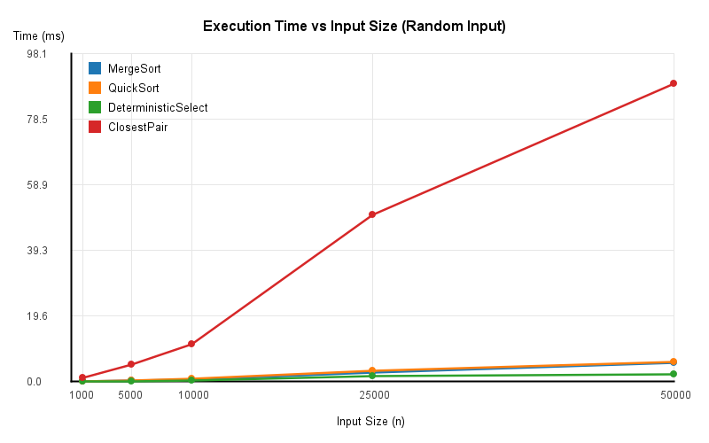
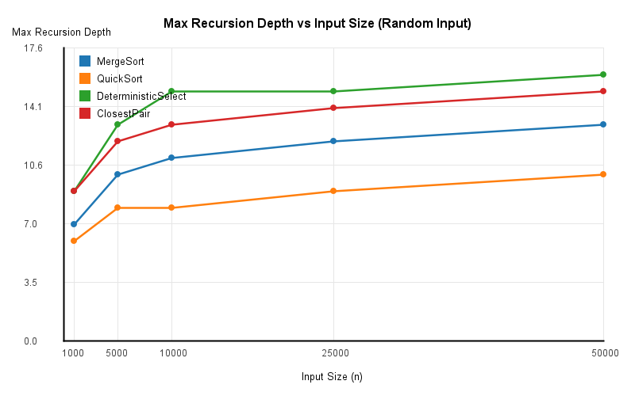
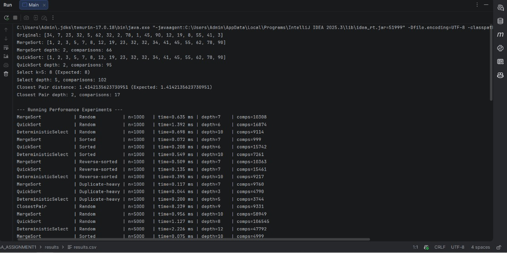
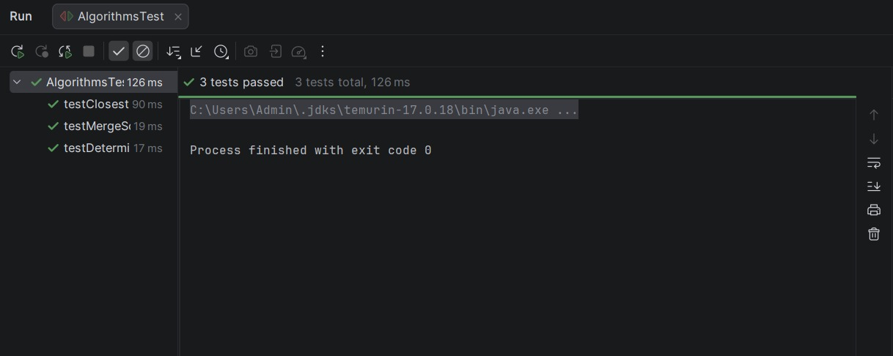

# Assignment 1: Divide-and-Conquer Algorithm Analysis

## A. Project Overview

The goal of this project is to implement four classic divide-and-conquer algorithms in Java, analyze their theoretical running-time recurrences using the Master Theorem and Akra-Bazzi intuition, and evaluate their practical performance across different input sizes and distributions.

### Implemented Algorithms
1. **MergeSort** (`MergeSorter.java`) — $\Theta(n \log n)$ sorting algorithm using a single reusable auxiliary buffer, linear merge, and an insertion sort cutoff ($n \le 16$).
2. **QuickSort** (`QuickSorter.java`) — Randomized QuickSort with in-place 3-way partitioning and tail-call optimization (recursing only on the smaller partition and iterating over the larger one).
3. **Deterministic Select** (`DeterministicSelector.java`) — Worst-case $\Theta(n)$ order-statistic selection using the Median-of-Medians pivot strategy (groups of 5) and in-place partitioning.
4. **Closest Pair of Points** (`ClosestPairSolver.java`) — $\Theta(n \log n)$ geometric divide-and-conquer algorithm using $x$-coordinate sorting, recursive splitting, and $y$-ordered strip checking.

---

## B. Algorithm Analysis

### 1. MergeSort
* **How it works:** Divides the array into two halves recursively until the subarray size reaches the cutoff threshold ($16$), where Insertion Sort is applied. The sorted halves are merged in linear time using a pre-allocated auxiliary array `aux`, skipping the merge step if `array[mid] <= array[mid + 1]`.
* **Time Complexity:** Best: $\Theta(n)$ (with pre-sorted check), Average: $\Theta(n \log n)$, Worst: $\Theta(n \log n)$.
* **Space Complexity:** $\Theta(n)$ for the reusable auxiliary buffer and $\Theta(\log n)$ recursion stack depth.
* **Recurrence & Master Theorem Analysis:**
  $$T(n) = 2T\left(\frac{n}{2}\right) + \Theta(n)$$
  Here $a = 2$, $b = 2$, and $f(n) = \Theta(n)$. Since $n^{\log_b a} = n^{\log_2 2} = n^1$, we have $f(n) = \Theta(n^{\log_b a})$, which falls under **Case 2 of the Master Theorem**, yielding $T(n) = \Theta(n \log n)$.

### 2. QuickSort
* **How it works:** Selects a random pivot element and partitions the subarray in-place into three regions ($<$, $=$, $>$ pivot). To bound the recursion stack, the algorithm checks the sizes of the left and right partitions, recursively sorts only the smaller partition, and updates the loop boundaries to iterate over the larger partition.
* **Time Complexity:** Best: $\Theta(n \log n)$ ($\Theta(n)$ on identical elements with 3-way split), Average: $\Theta(n \log n)$, Worst: $O(n^2)$.
* **Space Complexity:** $O(\log n)$ worst-case auxiliary stack space guaranteed by smaller-first recursion.
* **Recurrence & Analysis:**
  In the expected case with balanced splits:
  $$T(n) = 2T\left(\frac{n}{2}\right) + \Theta(n) \implies \Theta(n \log n) \text{ (Master Theorem Case 2)}$$
  For uneven splits (e.g., $\frac{1}{4}$ and $\frac{3}{4}$), **Akra-Bazzi intuition** gives $T(n) = T(n/4) + T(3n/4) + \Theta(n)$. Finding $p$ such that $(1/4)^p + (3/4)^p = 1$ yields $p = 1$, which integrates to $T(n) = \Theta(n \log n)$. In the worst case (unbalanced split of $0$ and $n-1$), $T(n) = T(n-1) + \Theta(n) = O(n^2)$.

### 3. Deterministic Select (Median-of-Medians)
* **How it works:** Divides the input into groups of 5, sorts each group of 5 using Insertion Sort, and recursively finds the true median of the $\lceil n/5 \rceil$ group medians to use as a pivot. Partitions the array in-place around this pivot and continues only into the partition containing index $k$.
* **Time Complexity:** Best, Average, and Worst-case: $\Theta(n)$.
* **Space Complexity:** $O(\log n)$ recursion stack depth (in-place rearrangement).
* **Recurrence & Akra-Bazzi Intuition:**
  Finding the median of medians takes $T(n/5)$, and the pivot is guaranteed to eliminate at least $30\%$ of elements, leaving at most $7n/10$ elements for the recursive search:
  $$T(n) \le T\left(\frac{n}{5}\right) + T\left(\frac{7n}{10}\right) + \Theta(n)$$
  Using **Akra-Bazzi intuition**, the sum of the recursive fractions is $\frac{1}{5} + \frac{7}{10} = \frac{9}{10} < 1$. Because the work shrinks geometrically by at least $\frac{9}{10}$ at each level ($p < 1$), the linear work $\Theta(n)$ at the root dominates the recurrence, yielding $T(n) = \Theta(n)$.

### 4. Closest Pair of Points
* **How it works:** Sorts all points by $x$-coordinate once, then recursively divides the point set in half to find the minimum distance $\delta = \min(d_1, d_2)$. Merges points by $y$-coordinate and constructs a vertical strip of points within distance $\delta$ of the dividing line. For each point in the strip, checks subsequent points whose $y$-distance is less than $\delta$ (at most 7 neighbors).
* **Time Complexity:** $\Theta(n \log n)$ in all cases.
* **Space Complexity:** $\Theta(n)$ for the auxiliary array and $\Theta(\log n)$ stack space.
* **Recurrence & Master Theorem Analysis:**
  $$T(n) = 2T\left(\frac{n}{2}\right) + \Theta(n)$$
  Sorting by $y$ via linear merge and scanning the strip both take $\Theta(n)$ time. By **Case 2 of the Master Theorem** ($a = 2, b = 2, f(n) = \Theta(n)$), the recursive phase takes $\Theta(n \log n)$, matching the initial $x$-coordinate sort.

---

## C. Experimental Results

### 1. Performance on Random Inputs (Execution Time & Max Recursion Depth)

| Size ($n$) | MergeSort Time (ms) | MergeSort Depth | QuickSort Time (ms) | QuickSort Depth | Select Time (ms) | Select Depth | ClosestPair Time (ms) | ClosestPair Depth |
| :--- | :--- | :--- | :--- | :--- | :--- | :--- | :--- | :--- |
| **1,000** | 0.6352 | 7 | 1.3922 | 6 | 0.6976 | 10 | 8.2391 | 9 |
| **5,000** | 0.9563 | 10 | 1.1265 | 8 | 2.2256 | 12 | 11.9766 | 12 |
| **10,000** | 1.7422 | 11 | 6.7480 | 9 | 0.8778 | 13 | 18.3829 | 13 |
| **25,000** | 6.9655 | 12 | 3.3398 | 9 | 2.2270 | 14 | 46.1348 | 14 |
| **50,000** | 13.4568 | 13 | 6.6030 | 10 | 3.3351 | 15 | 149.8741 | 15 |

### 2. Performance Across Different Input Types ($n = 50,000$)

| Algorithm | Input Type | Time (ms) | Max Depth | Comparisons |
| :--- | :--- | :--- | :--- | :--- |
| **MergeSort** | Random | 13.4568 | 13 | 773,262 |
| **MergeSort** | Sorted | 3.9831 | 13 | 49,999 |
| **MergeSort** | Reverse-sorted | 15.0910 | 13 | 583,503 |
| **MergeSort** | Duplicate-heavy | 9.7688 | 13 | 736,507 |
| **QuickSort** | Random | 6.6030 | 10 | 1,369,442 |
| **QuickSort** | Sorted | 6.2961 | 10 | 1,510,617 |
| **QuickSort** | Reverse-sorted | 5.6111 | 9 | 1,524,521 |
| **QuickSort** | Duplicate-heavy | 1.0579 | 2 | 365,866 |
| **DeterministicSelect** | Random | 3.3351 | 15 | 495,603 |
| **DeterministicSelect** | Sorted | 2.3775 | 16 | 391,645 |
| **DeterministicSelect** | Reverse-sorted | 3.9110 | 16 | 510,802 |
| **DeterministicSelect** | Duplicate-heavy | 1.9965 | 8 | 190,929 |

### 3. Plots

#### Execution Time vs. $n$

#### Recursion Depth vs. $n$

---

## D. Discussion

1. **Do the results match theoretical complexity?**
   Yes. At $n = 50,000$, `DeterministicSelect` finishes in $3.33\text{ ms}$ with $495,603$ comparisons (roughly $10n$, confirming $\Theta(n)$ behavior), whereas `MergeSort` and `QuickSort` scale as $\Theta(n \log n)$ with $773,262$ and $1,369,442$ comparisons respectively. Recursion depths grow logarithmically with $n$ (from $6\text{--}10$ at $n = 1,000$ to $10\text{--}15$ at $n = 50,000$).
2. **How does input structure affect performance?**
    * **Sorted inputs:** `MergeSort` drops from $773,262$ comparisons to just $49,999$ ($n - 1$) because the `array[mid] <= array[mid + 1]` check bypasses merging on sorted subarrays, running Insertion Sort at the leaves.
    * **Reverse-sorted inputs:** `QuickSort` maintains $\approx 5.61\text{ ms}$ on reverse-sorted data because random pivot selection prevents worst-case $O(n^2)$ degradation.
    * **Duplicate-heavy inputs:** Because 3-way partitioning groups all elements equal to the pivot in the middle, `QuickSort` finishes in $1.05\text{ ms}$ with a max recursion depth of just $2$ when sorting arrays with 10 distinct values.
3. **Why does smaller-first recursion help QuickSort?**
   When partitioning produces unbalanced splits, recursing only on the smaller subarray guarantees that the problem size is at least halved on every recursive call ($n \to \le n/2$). Processing the larger partition iteratively via a loop bounds the maximum call stack depth to $O(\log n)$ even in the worst-case $O(n^2)$ time scenario, completely preventing `StackOverflowError`.
4. **Why does Median-of-Medians guarantee $O(n)$?**
   By grouping elements into 5s and taking the median of group medians, at least half of the $\lceil n/5 \rceil$ groups have medians $\le$ the pivot, and each such group contributes at least 3 elements $\le$ the pivot. Thus, at least $3n/10$ elements are $\ge$ the pivot and $3n/10$ are $\le$ the pivot. Discarding at least $30\%$ of the elements at every step yields $T(n) \le T(n/5) + T(7n/10) + cn$, where $\frac{1}{5} + \frac{7}{10} = 0.9 < 1$, resulting in a convergent geometric series bounded by $O(n)$.
5. **Why is divide-and-conquer Closest Pair faster than $O(n^2)$ for large inputs?**
   A brute-force check at $n = 50,000$ requires $\frac{n(n-1)}{2} \approx 1.25 \times 10^9$ distance calculations. The divide-and-conquer approach only performs $745,981$ distance/coordinate comparisons at $n = 50,000$ (over $1,600\times$ fewer operations) because geometric packing constraints in the $2\delta \times \delta$ rectangle limit the inner strip loop to at most 7 comparisons per point.
6. **What practical factors affect performance (JVM, cache, GC, etc.)?**
    * **JIT Compilation & Warmup:** Notice that `QuickSort` took $6.74\text{ ms}$ at $n = 10,000$ but dropped to $3.33\text{ ms}$ at $n = 25,000$ once the JVM HotSpot JIT compiler optimized the hot loop.
    * **Garbage Collection & Allocations:** Pre-allocating a single auxiliary array in `MergeSort` and `ClosestPairSolver` avoids thousands of short-lived heap allocations during recursion, eliminating GC pauses.
    * **Cache Locality:** Primitive `int[]` arrays in `QuickSort` and `MergeSort` sit contiguously in CPU L1/L2 cache, whereas `Point[]` arrays in `ClosestPairSolver` involve object pointer dereferencing and `Math.hypot` calls, explaining why `ClosestPair` takes more wall-clock time per operation.

---

## E. Reflection

Working on this assignment demonstrated how theoretical asymptotic bounds interact with low-level implementation details. Implementing `DeterministicSelect` and `ClosestPairSolver` highlighted the importance of constant factors: while Median-of-Medians guarantees worst-case $\Theta(n)$ time, its recursive pivot-finding overhead makes it comparable to $\Theta(n \log n)$ sorting on small inputs ($n = 1,000$), only showing a clear speed advantage at larger scales ($n \ge 25,000$). Similarly, adding a 16-element Insertion Sort cutoff and a reusable buffer to `MergeSort` significantly reduced memory overhead and improved execution speed on partially sorted arrays.

The main implementation challenge was maintaining in-place index boundaries during the Median-of-Medians step in `DeterministicSelector` and ensuring the $y$-coordinate merge in `ClosestPairSolver` did not corrupt the $x$-coordinate partitioning in higher recursive levels. Writing automated JUnit tests against `Arrays.sort()` and brute-force $O(n^2)$ solvers was essential for catching off-by-one boundary issues early.

---

## F. Screenshots

### 1. Program Output & Experimental Measurements

### 2. JUnit Correctness Test Results
